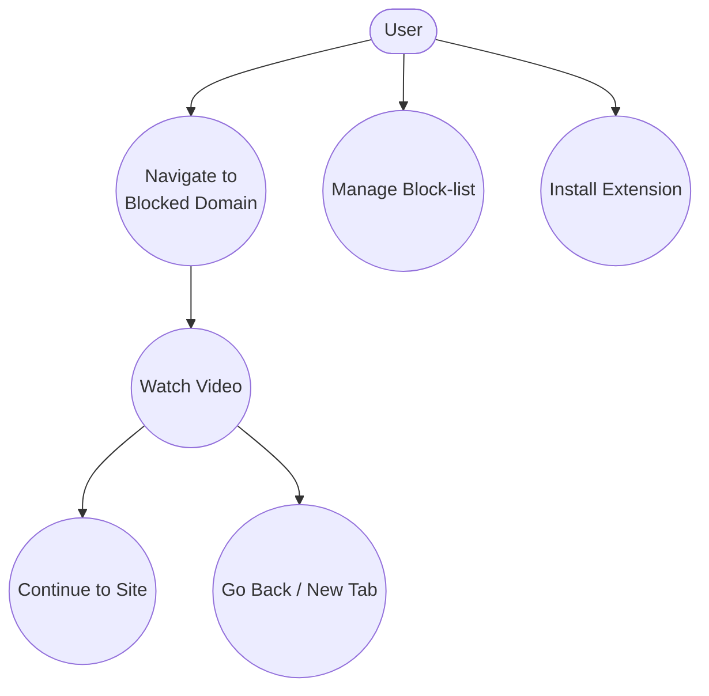
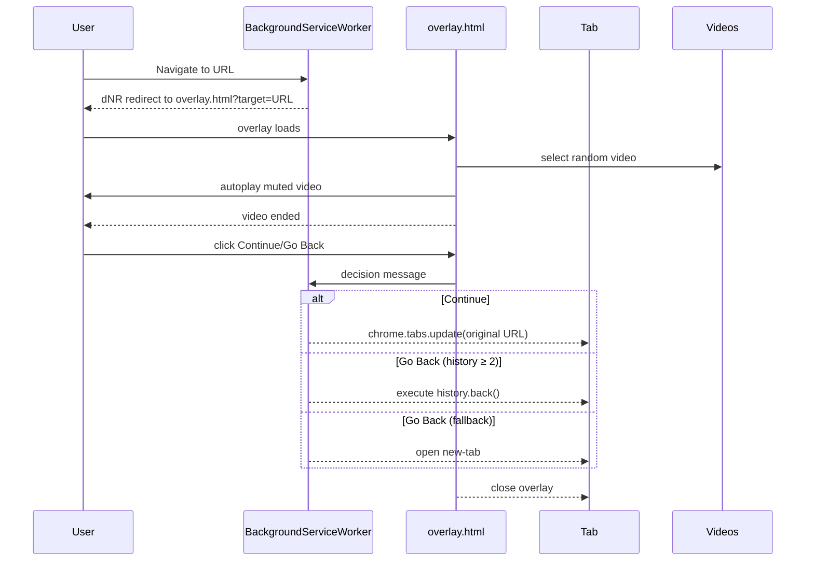
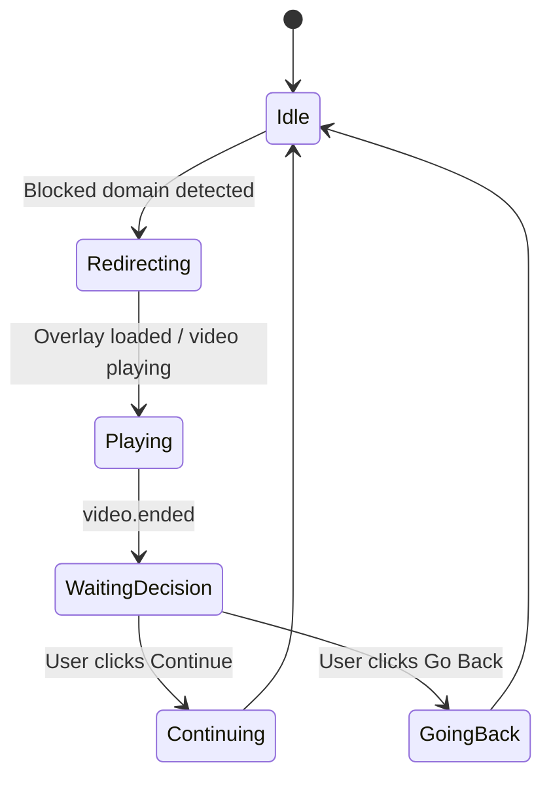

# Software Requirements Specification (SRS): LaserFocus

---

## 1  Introduction

### 1.1 Purpose

This Software Requirements Specification (SRS) refines the **LaserFocus** Product Requirements Document into an implementation‑ready reference for developers and QA engineers. It identifies all functional and non‑functional constraints required for a compliant, shippable Chrome Extension.

### 1.2 Scope and Boundaries

|                  |                                                                                                                                                                                                                                                                                                                                                                    |
| ---------------- | ------------------------------------------------------------------------------------------------------------------------------------------------------------------------------------------------------------------------------------------------------------------------------------------------------------------------------------------------------------------ |
| **In Scope**     | • Desktop Google Chrome extension conforming to Manifest V3<br>• Redirection of navigation to user‑defined distracting domains via `declarativeNetRequest`<br>• Full‑screen motivational video overlay and post‑video decision flow<br>• Options page for managing block‑list (storage via `chrome.storage.sync`)<br>• Default block‑list seeding at first install |
| **Out of Scope** | • Analytics dashboards or remote servers (zero external requests)<br>• Support for non‑Chromium or mobile browsers (until MV3 support exists)<br>• Custom video uploads or streaming from external CDNs<br>• Multi‑profile synchronization beyond `chrome.storage.sync`                                                                                            |

### 1.3 Definitions, Acronyms, and Abbreviations

| Term        | Definition                                                       |
| ----------- | ---------------------------------------------------------------- |
| **eTLD+1**  | Effective top‑level domain plus one label (e.g., `facebook.com`) |
| **dNR**     | `chrome.declarativeNetRequest` API                               |
| **Overlay** | `overlay.html` full‑screen page rendered by the extension        |
| **PRD**     | Product Requirements Document                                    |
| **SRS**     | Software Requirements Specification                              |
| **WCAG**    | Web Content Accessibility Guidelines                             |

---

## 2  Overall Description

### 2.1 Product Perspective

LaserFocus is a lightweight desktop‑Chrome extension that replaces unconscious browsing with a forced pause. It redirects any navigation to a blocked domain to an internal overlay page that plays a muted motivational video. Only after the clip finishes can the user choose to proceed or retreat.

### 2.2 Product Functions

* Intercept and redirect navigation to block‑listed domains *before first byte*.
* Present responsive, full‑screen overlay with muted autoplay video.
* Enforce “watch‑to‑end” by disabling actions until `video.ended`.
* Provide **Continue** (resume navigation) and **Go Back** (history.back or new‑tab) decisions.
* Persist per‑user block‑list in sync storage; default list auto‑seeded on install.
* Options page for real‑time block‑list editing.
* Shuffle‑queue video selection ensuring variety (≥ 2 distinct in any 10 interceptions).
* Skip all interception when block‑list is empty.
* Bundle all assets locally; no external network requests at runtime.
* Overlay meets WCAG 2.1 AA accessibility standards.

### 2.3 User Characteristics

Knowledge‑workers and students using desktop Chrome, low‑to‑medium technical skill, accustomed to installing extensions but unwilling to tweak complex settings.

### 2.4 Constraints

| Category                   | Specification                                                                                                                       |
| -------------------------- | ----------------------------------------------------------------------------------------------------------------------------------- |
| **Platform**               | Desktop Google Chrome supporting Manifest V3                                                                                        |
| **Technology Stack**       | HTML5, CSS3, JavaScript (ES2020+); no build step required                                                                           |
| **Libraries & Frameworks** | Vanilla JS only (no external libraries)                                                                                             |
| **APIs & Dependencies**    | `chrome.declarativeNetRequest`, `chrome.storage.*`, `chrome.tabs`, `chrome.scripting`, `chrome.runtime`                             |
| **Performance**            | Redirection must occur *before* any page content loads (verified in FR‑001); overlay must be responsive from 320 px – 2560 px width |
| **Accessibility**          | Overlay must comply with WCAG 2.1 AA (focus trap, semantic roles, contrast)                                                         |
| **Package Size**           | Total extension bundle ≤ 200 MB (Chrome Web Store limit)                                                                            |

### 2.5 Assumptions

* User grants requested permissions during installation.
* Chrome continues to support Manifest V3 APIs as documented.
* Video files are ≤ 10 MB each, muted, and encoded for autoplay on Chrome.

### 2.6 Use Cases

#### 2.6.1 Use‑Case Diagram



#### 2.6.2 Use‑Case Details

| UC‑ID | Name                       | Actor | Preconditions                                  | Post‑conditions                             |
| ----- | -------------------------- | ----- | ---------------------------------------------- | ------------------------------------------- |
| UC‑01 | Navigate to Blocked Domain | User  | `blockedDomains` contains eTLD+1 of target URL | Request is redirected; overlay displayed    |
| UC‑02 | Watch Video                | User  | Overlay visible; video autoplay started        | Video reaches `ended`; buttons enabled      |
| UC‑03 | Continue to Site           | User  | UC‑02 complete                                 | Original URL loads in same tab              |
| UC‑04 | Go Back / New Tab          | User  | UC‑02 complete                                 | `history.back()` or new‑tab opened          |
| UC‑05 | Manage Block‑list          | User  | Extension installed                            | Updated list saved to `chrome.storage.sync` |
| UC‑06 | Install Extension          | User  | Chrome Web Store install                       | Default block‑list seeded once              |

---

## 3  System Architecture

### 3.1 Architecture Diagram

```mermaid
flowchart TD
    User -- navigate --> BSW(Background Service Worker)
    BSW -- dNR redirect --> Overlay[overlay.html<br/>(chrome‑extension://)]
    Overlay -- decision --> BSW
    BSW -- tabs.update/back --> Tab
    Options(Options Page) -- CRUD --> Storage[(chrome.storage.sync)]
    BSW -- read --> Storage
    Overlay -- read --> Videos[/videos/*.mp4/]
```

### 3.2 Data and Event Flow

1. **onBeforeRequest** → Service worker evaluates `blockedDomains`.
2. **Match** ⇒ Issues a `declarativeNetRequest` redirect to `overlay.html?target=<encodedURL>`.
3. Overlay selects random muted video via shuffle queue, plays, listens for `ended`.
4. User action (**Continue / Go Back**) → Overlay sends runtime message → service worker.
5. Service worker navigates to original URL or executes history/back fallback.
6. Overlay closes; control returns to page or new‑tab.

### 3.3 Directory Structure

```text
laserfocus/
 ├── manifest.json
 ├── src/
 │   ├── background/
 │   │   └── background.js
 │   ├── overlay/
 │   │   ├── overlay.html
 │   │   ├── overlay.js
 │   │   └── overlay.css
 │   └── options/
 │       ├── options.html
 │       └── options.js
 ├── videos/
 │   └── *.mp4
 └── tests/
     ├── unit/
     └── e2e/
```

---

## 4  Specific Requirements

### 4.1 Functional Requirements (FR)

| ID         | Requirement                                                                                                                                                             |
| ---------- | ----------------------------------------------------------------------------------------------------------------------------------------------------------------------- |
| **FR‑001** | Intercept every navigation whose eTLD+1 **or any sub‑domain** matches `blockedDomains`, *before first byte*, and redirect to `overlay.html?target=<originalURL>`.       |
| **FR‑002** | Domain matching shall be case‑insensitive and protocol‑agnostic.                                                                                                        |
| **FR‑003** | The original URL is reopened only if the user selects **Continue**.                                                                                                     |
| **FR‑004** | `overlay.html` hosts a container covering 100 vw × 100 vh with `z‑index ≥ 999999`.                                                                                      |
| **FR‑005** | Overlay displays a loading spinner until the `<video>` is ready.                                                                                                        |
| **FR‑006** | The `<video>` element is **muted**, `playsinline`, and `autoplay`; on autoplay failure a “Click to Play” overlay appears.                                               |
| **FR‑007** | Videos are selected via a shuffle‑queue algorithm that guarantees at least two distinct videos in any 10 consecutive interceptions.                                     |
| **FR‑008** | Decision buttons remain disabled until `video.ended`.                                                                                                                   |
| **FR‑009** | Clicking **Continue** closes overlay and loads the original URL via `chrome.tabs.update`.                                                                               |
| **FR‑010** | If the user clicks **Go Back** and `history.length ≥ 2`, execute `history.back()`; otherwise, update the tab to `chrome://newtab`.                                      |
| **FR‑011** | Options page presents a textarea (one domain per line) and **Save** button.                                                                                             |
| **FR‑012** | On **Save**, sanitized domains are stored in `chrome.storage.sync` under key `blockedDomains`.                                                                          |
| **FR‑013** | On first install, if `blockedDomains` is undefined, seed five defaults (`facebook.com`, `instagram.com`, `tiktok.com`, `youtube.com`, `twitter.com`).                   |
| **FR‑014** | If `blockedDomains` is empty, interception logic is skipped entirely.                                                                                                   |
| **FR‑015** | All video assets are bundled in `/videos/`; the extension makes **no** runtime network requests.                                                                        |
| **FR‑016** | Manifest V3 declares `"host_permissions": ["<all_urls>"]`, `"permissions": ["storage", "declarativeNetRequest", "tabs", "scripting"]`, and zero externally hosted code. |
| **FR‑017** | Overlay must comply with WCAG 2.1 AA: role `dialog`, `aria‑modal`, focus trap, logical heading order, ≥ 4.5:1 contrast.                                                 |
| **FR‑018** | Buttons and overlay controls must be fully operable via keyboard (tab‑focusable, `Enter`/`Space`).                                                                      |
| **FR‑019** | Redirection cancellation shall be implemented exclusively through `chrome.declarativeNetRequest` rule list.                                                             |

### 4.2 Non‑Functional Requirements (NFR)

| ID          | Requirement                                                                                                                |
| ----------- | -------------------------------------------------------------------------------------------------------------------------- |
| **NFR‑001** | ≥ 80 % reduction in visits to block‑listed domains after 14 days compared with user’s baseline (self‑reported statistics). |
| **NFR‑002** | ≥ 95 % of interceptions must reach full video playback with no premature exits.                                            |
| **NFR‑003** | First‑run experience shall require zero manual configuration; support tickets ≤ 1 / 1000 installs.                         |
| **NFR‑004** | Extension bundles *all* assets locally and makes zero external network requests.                                           |
| **NFR‑005** | Extension must comply with Google Chrome Web Store Manifest V3 policies.                                                   |
| **NFR‑006** | Overlay must cover viewport without visual artifacts on any device width 320 – 2560 px.                                    |
| **NFR‑007** | Overlay must satisfy WCAG 2.1 AA accessibility guidelines.                                                                 |
| **NFR‑008** | Automated test coverage (unit + e2e) ≥ 80 % lines/statements, enforced via CI pipeline (e.g., GitHub Actions).             |

### 4.3 Data Storage Requirements

| Key              | Type       | Scope                  | Description                                                  |
| ---------------- | ---------- | ---------------------- | ------------------------------------------------------------ |
| `blockedDomains` | `string[]` | `chrome.storage.sync`  | Array of sanitized eTLD+1 domain strings (no protocol/path). |
| `videoHistory`   | `string[]` | `chrome.storage.local` | Last 10 video IDs shown (supports shuffle‑queue logic).      |

### 4.4 External Interface Requirements

* **Chrome APIs:** `declarativeNetRequest`, `tabs`, `storage`, `runtime`, `scripting`.
* **User Interface:** `overlay.html` rendered from `chrome-extension://<id>/src/overlay/overlay.html`; options page from `chrome-extension://<id>/src/options/options.html`.
* **Permissions:** As declared in Manifest V3 (see FR‑016).

### 4.5 Execution Flows & State Machines

#### 4.5.1 Sequence Diagram



#### 4.5.2 State Machine Diagram



---

## 5  Acceptance Criteria & Testing

### 5.1 Test Strategy

* **Unit Tests:** Domain matching, storage CRUD, shuffle‑queue algorithm, history fallback logic.
* **Integration Tests (Puppeteer):** End‑to‑end navigation redirection, overlay behavior, decision flow.
* **Responsive Tests:** Viewport snapshots at 320 px, 768 px, 1920 px, 2560 px.
* **Accessibility Tests:** axe‑core automated checks, keyboard navigation, ARIA roles.
* **Performance Tests:** Verify redirection occurs before DOMContentLoaded of target site.
* **CI Pipeline:** GitHub Actions running all test suites; code coverage gate ≥ 80 %.

### 5.2 KPI Measurement

* **KPI‑1 (Visit Reduction):** Local log of blocked vs. allowed visits; users can export CSV.
* **KPI‑2 (Video Completion Rate):** Local counter of overlay invocations vs. `video.ended` events.
* **KPI‑3 (Support Ticket Rate):** Chrome Web Store dashboard metrics (no in‑app telemetry).

---

## 6  Traceability Matrix

| FR/NFR  | User Story / Goal / REQ / CF |
| ------- | ---------------------------- |
| FR‑001  | US‑001, US‑009, REQ‑001      |
| FR‑002  | REQ‑002                      |
| FR‑003  | US‑001, REQ‑003              |
| FR‑004  | REQ‑004                      |
| FR‑005  | CF‑02                        |
| FR‑006  | REQ‑005                      |
| FR‑007  | US‑006, REQ‑006              |
| FR‑008  | REQ‑007                      |
| FR‑009  | US‑002, REQ‑008              |
| FR‑010  | US‑003, REQ‑009 & REQ‑010    |
| FR‑011  | US‑004                       |
| FR‑012  | REQ‑011                      |
| FR‑013  | US‑005, REQ‑012              |
| FR‑014  | US‑007, REQ‑014              |
| FR‑015  | REQ‑015, CF‑08               |
| FR‑016  | REQ‑016                      |
| FR‑017  | US‑010, REQ‑017              |
| FR‑018  | US‑010, REQ‑018              |
| FR‑019  | CF‑01                        |
| NFR‑001 | G‑01                         |
| NFR‑002 | G‑02                         |
| NFR‑003 | G‑03                         |
| NFR‑004 | REQ‑015                      |
| NFR‑005 | CF‑08                        |
| NFR‑006 | US‑008                       |
| NFR‑007 | US‑010                       |
| NFR‑008 | —                            |
